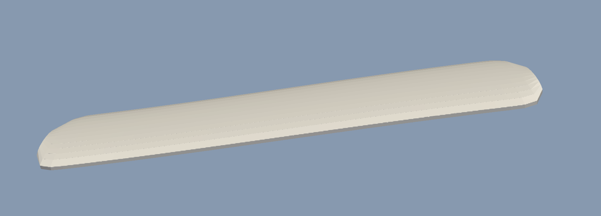
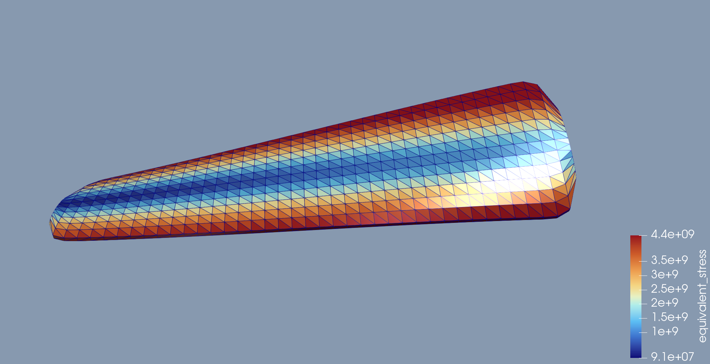

# Aeroelastic Flutter Simulation (C++)

Численное моделирование аэроупругого флаттера гибкого крыла с использованием собственного C++ solver-а, тетраэдральной сетки, reduced-order structural dynamics и VTK-визуализации.

---

# Демонстрация


---
# Возможности проекта

- Собственный аэроупругий решатель на C++
- Изгиб и кручение крыла
- Аэроупругий флаттер
- Модель эффективного угла
- Тетраэдральная FEM-сетка
- VTK / ParaView визуализация
- Расчет напряжений внутри тетраэдров
- Рост напряжений при флаттере
- Самовозбуждающиеся колебания

---

# Физическая модель

Проект реализует упрощенную, но физически осмысленную модель аэроупругого флаттера.

Цель модели:

- затухающие колебания при малой скорости потока;
- самовозбуждающиеся колебания около критической скорости;
- неустойчивый рост амплитуды при больших скоростях.

---

# Система координат

- **X** — направление потока
- **Y** — размах крыла
- **Z** — вертикальное направление

Набегающий поток:

$$
\mathbf{U}_\infty = (U,0,0)
$$

Корневая секция крыла жестко закреплена.

---

# Модель конструкции

Крыло описывается моделью с двумя степенями свободы:

- изгиб
- кручение

---

## Мода изгиба

Прогиб крыла:

$$
w(y,t) = q_b(t)\phi_b(y)
$$

где:

- $q_b$ — обобщенная координата изгиба
- $\phi_b(y)$ — форма изгибной моды

Консольная форма:

$$
\phi_b(\xi) = \xi^2(3 - 2\xi)
$$

где:

$\xi = \frac{-y}{L}$

---

## Мода кручения

Крутка крыла:

$$
\theta(y,t) = q_t(t)\phi_t(y) 
$$

где:

- $q_t$ — обобщенная координата кручения
- $\phi_t(y)$ — форма крутильной моды

Текущая реализация:

$$\phi_t(\xi) = \xi$$

или:

$$\phi_t(\xi) = \xi^2$$

---

## Кинематика малых углов

Кручение реализовано как линейная малоугловая ротация вокруг оси $Y$:

$x' = x + z\theta$

$z' = z - x\theta$

Приближение справедливо для малых деформаций.

---

# Динамика конструкции

Система уравнений движения:

$$
M\ddot q + C\dot q + Kq = Q_{aero}
$$

где:

$$ 
q =
\begin{bmatrix}
q_b \\
q_t
\end{bmatrix}
$$

Используются диагональные матрицы:

$$ 
M =
\begin{bmatrix}
m_b & 0 \\
0 & I_t
\end{bmatrix}
$$

$$
C =
\begin{bmatrix}
c_b & 0 \\
0 & c_t
\end{bmatrix}
$$

$$
K =
\begin{bmatrix}
k_b & 0 \\
0 & k_t
\end{bmatrix}
$$

Интегрирование по времени:

- метод Эйлера

---

# Аэродинамическая модель

Используется квази-устойчивая аэродинамика.

---

## Динамическое давление

$$
q_\infty = \frac12 \rho U^2 
$$

---

## Эффективный угол атаки

Главный механизм флаттера реализован через эффективный угол атаки:

$$
\alpha_{eff}=\theta+\frac{-\dot w + x\dot\theta}{U}
$$

Формула учитывает:

- геометрическое кручение;
- вертикальную скорость изгиба;
- скорость вращения профиля.

Это создает аэродинамическую связь между:

- изгибом;
- кручением;
- подъемной силой;
- аэродинамическим моментом.

---

## Unsteady Aerodynamic Lag

Для моделирования фазового запаздывания используется запаздывающая модель:

$$ 
\tau_a \dot\alpha_{lag}+\alpha_{lag}=\alpha_{eff}
$$

Подъемная сила рассчитывается через запаздывающий угол:

$C_L = C_{L\alpha}\alpha_{lag}$

Это позволяет моделировать:

- отрицательное демпфирование;


---

## Аэродинамический крутящий момент

Момент относительно оси кручения:

$M_y = -(x - x_{ac})L$

Именно этот момент связывает аэродинамику с кручением.

---

# Механизм флаттера

Флаттер возникает из-за замкнутой:

```text
Скорость изгиба
    ↓
Effective angle of attack
    ↓
Изменение подъемной силы
    ↓
Аэродинамический момент
    ↓
Кручение крыла
    ↓
Дополнительное изменение подъемной силы
    ↓
Рост колебаний
```

При малой скорости:

$C_{total} > 0$

Колебания затухают.

Около критической скорости:

$C_{total} \approx 0$

Появляются устойчивые oscillations.

Выше скорости флаттера:

$C_{total} < 0$

Амплитуда начинает расти.

---

# Расчет напряжений

Напряжения рассчитываются внутри тетраэдра.

---

## Изгибные напряжения

$\sigma = Ez\kappa$

где:

- $E$ — модуль Юнга
- $\kappa$ — кривизна

---

## Касательные напряжения при кручении

$\tau = Gr\frac{d\theta}{dy}$

где:

- $G$ — модуль сдвига
- $r$ — расстояние до оси кручения

---

## Эквивалентное напряжение

Эквивалентное напряжение по Мизесу:

$$
\sigma_{eq}=\sqrt{\sigma^2 + 3\tau^2}
$$

---

# Визуализация

Проект экспортирует VTK-файлы для ParaView.

Доступные поля:

- displacement
- pressure
- effective angle of attack
- lift
- bending deformation
- torsional deformation
- equivalent stress

---

# Режимы работы

| Скорость потока | Поведение |
|---|---|
| Низкая $U$ | Затухающие колебания |
| Около $U_{crit}$ | Устойчивые oscillations |
| Большая $U$ | Divergent flutter |

---

# Численные особенности

Модель использует:

- линейную упругость
- приближение малого угла
- кручение и изгиб
- квази-устойчивую аэродинамику

Модель намеренно упрощена для:

- вычислительной легкости;
- численной устойчивости;
- удобства расширения.

---

# Используемые технологии

- C++
- VTK
- ParaView
- Gmsh
- Tetrahedral FEM mesh

---

# Возможные улучшения

Потенциальные направления развития:

- нелинейная динамика
- неустойчивая динамика Theodorsen
- геометрическая нелинейность
- адаптивный шаг интегрирования

---

# Скриншоты

## Сетка

<p align="center">
  
</p>

---

## Поле напряжений

<p align="center">
  
</p>

---
